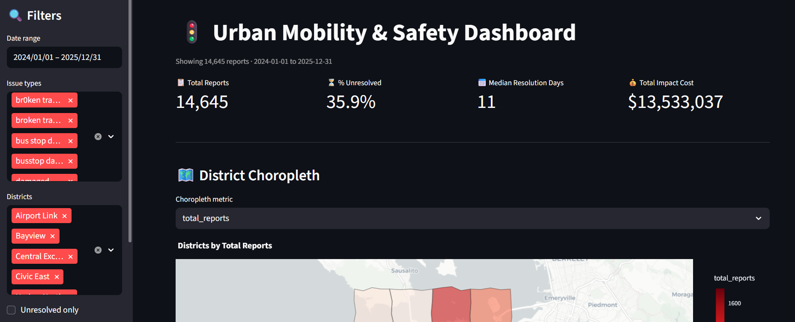

# 🚦 Urban Mobility & Safety Dashboard

> Interactive Streamlit dashboard for exploring urban mobility and safety reports across city districts — includes a full data wrangling pipeline, spatial joins, choropleth maps, and dynamic filters.

[](https://urban-mobility-dashboard-d7xngh3ylfsdy78kqviufj.streamlit.app/)

---

## 📸 Dashboard Preview



---

## 📊 Project Overview

This project analyzes **22,000+ urban mobility and safety reports** to uncover patterns in issue types, resolution times, geographic distribution, and severity across city districts.

**Key Objectives:**
- Build a full data wrangling pipeline from raw Excel data
- Assign reports to districts using spatial joins with GeoJSON boundaries
- Create an interactive dashboard with dynamic filters and auto-computed insights
- Enable data export for further analysis

---

## 🔍 Key Features

- **KPI Cards** — Total reports, % unresolved, median resolution days, total impact cost
- **Choropleth Map** — Districts colored by report count, unresolved rate, or median resolution days
- **Time Series Chart** — Reports grouped by week or month
- **Top Issue Types** — Bar chart of the 10 most frequent issues
- **District Comparison** — Unresolved rate by district
- **Summary Table** — Per-district stats with reports, unresolved %, resolution days, avg severity
- **Insight Panel** — 3 auto-computed observations from the filtered data
- **CSV Export** — Download the cleaned filtered dataset

---

## 🛠️ Data Wrangling Pipeline

- Parses `reported_at` and `resolved_at` with mixed timezone handling (`utc=True`)
- Deduplicates by `report_id`, keeping the latest valid entry
- Normalizes `issue_type` (lowercase, strip spaces, merge typo variants)
- Converts `severity` from mixed text/numeric to numeric 1–5 scale
- Cleans `estimated_impact_cost` by removing `$`, commas, and blanks
- Validates and drops rows with out-of-range coordinates (lat/lon)
- Engineers new features: `resolution_days`, `is_unresolved`, `report_week`, `report_month`, `severity_band`
- Assigns each report to a district via spatial join with `districts.geojson`

---

## 🔧 Sidebar Filters

- Date range on `reported_at`
- Issue type multi-select
- District multi-select
- Unresolved only toggle
- Severity band selector (low / medium / high)

---

## 🛠️ Tech Stack

| Layer | Tool |
|---|---|
| Language | Python 3.11+ |
| Dashboard | Streamlit |
| Data Processing | Pandas |
| Geospatial | GeoPandas, Shapely |
| Visualization | Plotly Express |
| Data Format | Excel, GeoJSON, CSV |

---

## 📁 Project Structure

```
urban-mobility-dashboard/
├── app.py                    # Main Streamlit application
├── districts.geojson         # District boundary polygons
├── cleaned_reports.csv       # Cleaned and processed dataset
├── requirements.txt          # Python dependencies
├── README.md                 # This file
└── screenshots/
    ├── screenshot_dashboard.png
    ├── screenshot_filters.png
    ├── screenshot_kpi.png
    ├── screenshot_map.png
    ├── screenshot_charts.png
    ├── screenshot_district_comparison.png
    ├── screenshot_table.png
    └── screenshot_insights.png
```

---

## 📂 Data

The raw dataset `mobility_reports.xlsx` is not included in this repository due to file size. The cleaned output `cleaned_reports.csv` is included and contains the result of the full wrangling pipeline.

---

## ▶️ How to Run Locally

### 1. Clone the repository

```bash
git clone https://github.com/ShoafzalDataAnalyst/urban-mobility-dashboard.git
cd path/to/urban-mobility-dashboard
```

### 2. Install dependencies

```bash
pip install -r requirements.txt
```

Or manually:

```bash
pip install pandas geopandas shapely plotly streamlit openpyxl
```

### 3. Run the app

```bash
python -m streamlit run app.py
```

The dashboard will open automatically in your browser at `http://localhost:8501`

> ⚠️ Run from Anaconda Prompt or terminal — do NOT run from inside Jupyter Notebook.

---

## ✅ What Worked

- Full data cleaning pipeline ran without errors on all 22,000+ rows
- Spatial join correctly assigned districts using `zone_name` from GeoJSON
- All 5 sidebar filters dynamically update every dashboard component
- Choropleth map renders correctly with hover tooltips for all districts
- Insight panel auto-computes meaningful observations from filtered data
- `@st.cache_data` prevents reloading/reprocessing data on every interaction

## ⚠️ Known Limitations

- The notebook (`.ipynb`) cannot run Streamlit directly — must be run from terminal as `app.py`
- Some `issue_type` typo variants may not be covered in all edge cases
- District assignment relies entirely on coordinates via spatial join (more accurate than text hints)
- The last week in the time series shows a drop because it is a partial week (data cutoff mid-week)

---

## 🤖 AI Tools Used

**Claude (Anthropic)** was used throughout this project as a coding assistant for generating the initial roadmap, suggesting the data cleaning approach, writing and debugging the full `app.py`, and fixing multiple runtime errors during development. All AI suggestions were reviewed and tested before use.

---

## 📧 Contact

**Shoafzal Shomuhidov**
- GitHub: [@ShoafzalDataAnalyst](https://github.com/ShoafzalDataAnalyst)
- LinkedIn: [shoafzal-shomuhidov](https://www.linkedin.com/in/shoafzal-shomuhidov-15b647389/)
- Email: shomuhidov.shoafzal@gmail.com